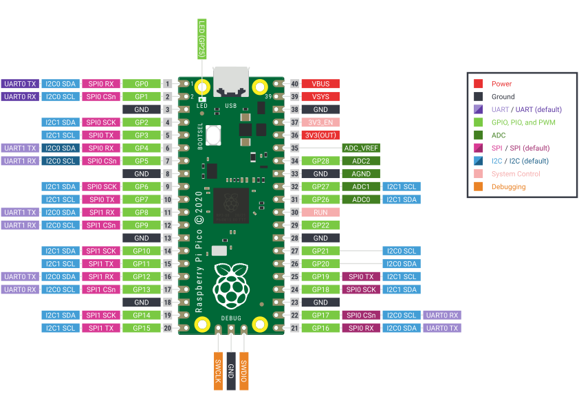

# Library with *FFT* functions for the Pico 

A lightweight and efficient wrapper for the [KISS FFT](https://github.com/mborgerding/kissfft) library, designed specifically for the Raspberry Pi Pico. It simplifies the implementation of Fast Fourier Transform (FFT) operations on the Pico, making it easier to perform frequency domain analysis and signal processing tasks.

> [!NOTE]
> This library is still in an experimental phase but includes basic documentation explaining its usage further down. All three of the [examples](https://github.com/Googool/pico_fft/tree/main/examples) has been tested and are working as intended.

## Quickstart 🚀

Getting started with this library is straightforward. This guide will help you connect an analog microphone to the Raspberry Pi Pico and get started with the `pico_fft` library for performing Fast Fourier Transforms (FFT).

### Prerequisites

- Raspberry Pi Pico (RP2040)
- Analog microphone module (e.g., KY-038, MAX9814)
- Breadboard and jumper wires

Follow the official [Getting Started with Raspberry Pi Pico](https://www.raspberrypi.com/documentation/microcontrollers/c_sdk.html) guide in order to setup the Pico SDK and visit the [CMake download page](https://cmake.org/download/) for installation instructions.



### Hardware Connections

Connecting the Raspberry Pi Pico to your analog microphone module should be straightforward. Below is the recommended connection setup:

| Raspberry Pi Pico  | Analog Microphone Module |
| ------------------ | ------------- |
| 3V3                | VCC           |
| GPIO26 (ADC0)      | OUT           |
| GND                | GND           |

*Ensure that the analog microphone can run on 3.3V. Most 5.0V modules can still run with a lower supplied voltage, but verify before you proceed.*

### Software Setup

**Step 1: Clone the Repository**
```sh
git clone https://github.com/Googool/pico_fft.git
cd pico_fft
```

*The library can also be added as a submodule for an existing project using [git submodules](https://git-scm.com/book/en/v2/Git-Tools-Submodules).*

**Step 2: Build the Library and Examples**
```sh
mkdir build
cd build
cmake ..
make
```

**Step 3: Flash the Example to the Pico**

This can be done in two ways. The easiest one is to hold down the `BOOTSEL` button on your Raspberry Pi Pico while connecting the USB - here you can just drag the `.uf2` file directly onto the board.

The other one requires the [picotool](https://github.com/raspberrypi/picotool) which enables you to flash the Raspberry Pi Pico through your terminal.

```sh
picotool load -f examples/fft_example.uf2
```

## Examples

Here is a basic example demonstrating how to use the `pico_fft` library:

```c
#include "pico/stdlib.h"
#include "pico/fft.h"

void main() {
  fft_setup();

  uint8_t capture_buf[NSAMP];
  frequency_bin_t bins[BIN_COUNT]; // Define BIN_COUNT according to your requirements

  while (true) {
    fft_sample(capture_buf);
    fft_process(capture_buf, bins, BIN_COUNT);
    // Process or display the results
  }
}
```

### Function Explanations

- **`fft_setup()`**: Initializes the ADC and DMA configurations for capturing analog signals. Sets up the FFT parameters such as sampling rate and frequency bins.

- **`fft_sample(uint8_t *capture_buf)`**: Captures a buffer of analog samples from the ADC using DMA. The captured data is stored in the provided buffer.

- **`fft_process(uint8_t *capture_buf, frequency_bin_t *bins, int bin_count)`**: Processes the captured samples using FFT, calculating the frequency spectrum and storing the results in the provded bins.

### Creating Frequency Bins

Here is an example of how to create and use frequency bins with the `pico_fft` library:

```c
#include "pico/stdlib.h"
#include "pico/fft.h"

#define BIN_COUNT 10

int main() {
  stdio_init_all();
  fft_setup();

  uint8_t capture_buf[NSAMP];
  frequency_bin_t bins[BIN_COUNT] = {
    {"Bin 1", 0, 2000, 0},
    {"Bin 2", 2001, 4000, 0},
    {"Bin 3", 4001, 6000, 0},
    {"Bin 4", 6001, 8000, 0},
    {"Bin 5", 8001, 10000, 0},
    {"Bin 6", 10001, 12000, 0},
    {"Bin 7", 12001, 14000, 0},
    {"Bin 8", 14001, 16000, 0},
    {"Bin 9", 16001, 18000, 0},
    {"Bin 10", 18001, 20000, 0}
  };

  while (true) {
    fft_sample(capture_buf);
    fft_process(capture_buf, bins, BIN_COUNT);

    for (int i = 0; i < BIN_COUNT; i++) {
      printf("%s: Amplitude = %f\n", bins[i].name, bins[i].amplitude);
    }

    sleep_ms(1000);
  }

  return 0;
}
```

### Explanation

- **Define `BIN_COUNT`**: Set the number of frequency bins you want to use.

- **Create frequency bins**: Define an array of `frequency_bin_t` structures, each representing a frequency range (in Hz) and an initial amplitude of 0.

- **Initialize and use**: In the main loop, capture the analog samples, process them using FFT, and then print the amplitude of each frequency bin.

See the [examples](https://github.com/Googool/pico_fft/tree/main/examples) folder for sample programs that demonstrates how to use this library.

## License

The content and software in this [repository](https://github.com/Googool/pico_fft) are licensed under the [MIT license](https://mit-license.org/).
